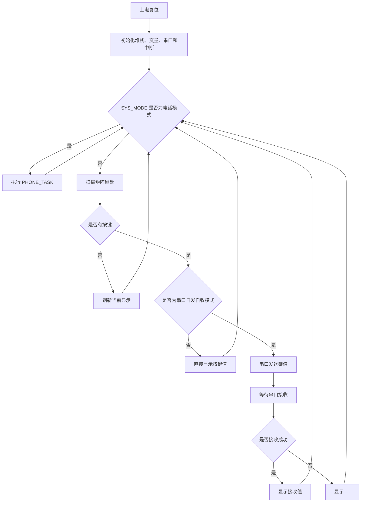
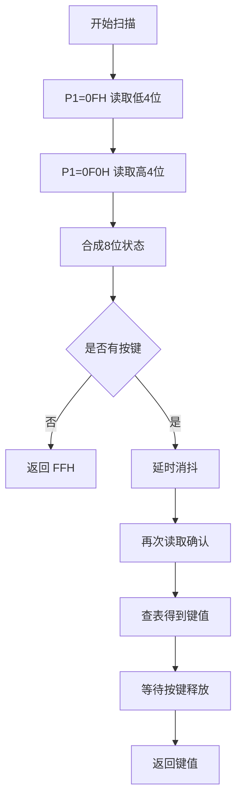
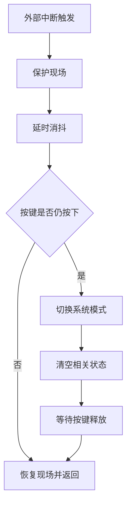
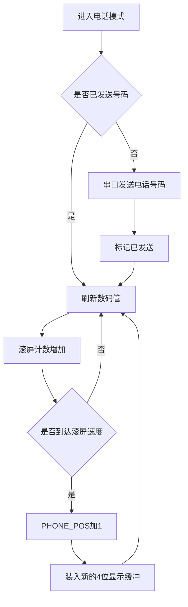

# 单片机模块应用设计系统课程设计报告

## 一、设计任务与功能介绍

本次课程设计题目为“单片机模块应用设计系统”。系统基于 STC89C52RC 单片机和普中 51 实验板，使用 8051 汇编语言完成数码管显示、矩阵键盘扫描、外部中断切换、串口通信和电话号码滚屏显示等功能。

系统实现的主要功能如下：

1. 上电后 4 位 LED 数码管显示 `C875`。
2. 使用 4x4 矩阵键盘输入按键值，并在数码管最右位显示对应键值。
3. 通过 `K3/P3.2/INT0` 外部中断切换到串口自发自收模式。单片机识别矩阵键盘按键后，将键值通过串口发送，再通过短接的 `TXD` 与 `RXD` 接收回来，并在数码管显示接收到的键值。
4. 通过 `K4/P3.3/INT1` 外部中断切换到电话号码模式。系统通过串口向电脑发送一次电话号码，并在 4 位数码管上循环滚屏显示该电话号码。

本系统采用模块化程序结构，将主程序、显示、键盘、串口、中断、电话号码和延时功能分别放在不同的 `.asm` 文件中，便于调试和维护。

## 二、硬件方案设计说明

### 2.1 单片机与开发板

本设计使用 STC89C52RC 系列 51 单片机，开发环境为 Keil C51，程序语言为汇编语言。开发板采用普中 51 实验板，使用板上已有的 4 位 LED 数码管、矩阵键盘、独立按键和串口通信模块。

### 2.2 数码管显示电路

4 位 LED 数码管采用动态扫描方式显示。段码由 `P0` 口输出，位选由 `P2.2 ~ P2.4` 控制。程序通过快速轮流点亮不同位数码管，使人眼看到稳定的 4 位显示效果。

本系统中使用的数码管段码为共阴极段码，例如：

- `0`：`3FH`
- `1`：`06H`
- `8`：`7FH`
- `C`：`39H`
- `-`：`40H`

### 2.3 矩阵键盘电路

矩阵键盘连接到 `P1.0 ~ P1.7`。程序采用线反转法扫描键盘：第一次令一组线输出低电平、另一组线作为输入读取；第二次反向设置端口，再读取另一组线状态。两次读取结果合成 8 位状态值后，通过查表得到按键值。

按键映射如下：

| 按键 | 显示值 |
|---|---|
| S1 | 0 |
| S2 | 1 |
| S3 | 2 |
| S4 | 3 |
| S5 | 4 |
| S6 | 5 |
| S7 | 6 |
| S8 | 7 |
| S9 | 8 |
| S10 | 9 |
| S11 | A |
| S12 | B |
| S13 | C |
| S14 | D |
| S15 | E |
| S16 | F |

### 2.4 外部中断与独立按键

本设计使用两个外部中断按键完成模式切换：

- `K3/P3.2/INT0`：切换普通键盘模式和串口自发自收模式。
- `K4/P3.3/INT1`：切换普通键盘模式和电话号码滚屏模式。

程序中设置 `IT0=1`、`IT1=1`，即两个外部中断均采用下降沿触发。中断服务程序中加入软件延时消抖，并等待按键释放后再退出。

### 2.5 串口通信电路

串口使用 8051 串口模式 1，8 位 UART 通信方式。定时器 1 设置为方式 2 自动重装模式，用于产生串口波特率。程序默认使用 `11.0592MHz` 晶振、`9600bps` 波特率，设置如下：

```asm
MOV SCON, #50H
MOV TMOD, #20H
MOV TH1, #0FDH
MOV TL1, #0FDH
SETB TR1
```

串口自发自收模式需要短接：

```text
P3.1 / TXD -> P3.0 / RXD
```

电话号码模式下，串口向电脑发送 ASCII 形式的电话号码。

## 三、软件方案设计说明

### 3.1 程序模块划分

| 文件 | 功能 |
|---|---|
| `main.asm` | 主程序入口、变量定义、系统初始化、模式分发 |
| `display.asm` | 数码管动态扫描显示、按键显示、滚屏缓冲显示 |
| `keyboard.asm` | 矩阵键盘线反转法扫描 |
| `interrupt.asm` | 外部中断 0 和外部中断 1 服务程序 |
| `uart.asm` | 串口初始化、串口发送、串口接收 |
| `phone.asm` | 电话号码串口发送和滚屏显示 |
| `delay.asm` | 延时子程序，用于显示扫描和按键消抖 |

### 3.2 系统工作模式

系统使用变量 `SYS_MODE` 表示当前工作模式：

| 模式值 | 模式名称 | 功能 |
|---|---|---|
| `00H` | 普通键盘模式 | 矩阵键盘按键直接显示 |
| `01H` | 串口自发自收模式 | 按键值串口发送后回环接收显示 |
| `02H` | 电话号码模式 | 串口发送电话号码并滚屏显示 |

上电后系统默认进入普通键盘模式。

## 四、内部 RAM 使用说明

本程序使用内部 RAM `30H ~ 38H` 保存系统状态和显示缓冲。

| 地址 | 名称 | 用途 |
|---|---|---|
| `30H` | `KEY_SAVE` | 保存最后一次显示值，`FFH` 表示未按键，`FEH` 表示串口超时 |
| `31H` | `SYS_MODE` | 当前系统模式 |
| `32H` | `PHONE_POS` | 电话号码滚屏起始位置 |
| `33H` | `PHONE_CNT` | 电话号码滚屏速度计数 |
| `34H` | `PHONE_SENT` | 电话号码是否已通过串口发送 |
| `35H` | `DISP0` | 第 1 位数码管显示缓冲 |
| `36H` | `DISP1` | 第 2 位数码管显示缓冲 |
| `37H` | `DISP2` | 第 3 位数码管显示缓冲 |
| `38H` | `DISP3` | 第 4 位数码管显示缓冲 |

## 五、程序流程图

> 以下流程图可在支持 Mermaid 的编辑器中预览，也可以截图后放入 Word 报告。

### 5.1 主程序流程图



### 5.2 矩阵键盘扫描流程图



### 5.3 外部中断流程图



### 5.4 电话号码滚屏流程图



## 六、主要程序说明

### 6.1 主程序 `main.asm`

主程序完成复位入口、中断入口、变量定义、系统初始化和模式分发。系统初始化时打开外部中断 0 和外部中断 1，并初始化串口。主循环根据 `SYS_MODE` 选择不同任务。

### 6.2 显示模块 `display.asm`

显示模块采用动态扫描方式显示 4 位数码管。`SHOW_C875` 用于默认显示；`SHOW_KEY` 用于显示单个按键值；`SHOW_BUF` 用于显示电话滚屏缓冲；`SHOW_DASH` 用于串口接收超时时显示 `----`。

### 6.3 键盘模块 `keyboard.asm`

键盘模块采用线反转法读取矩阵键盘，读取两次端口状态后查表得到 `0 ~ F` 的按键值。程序包含延时消抖和等待按键释放逻辑，可避免一次按键被重复识别。

### 6.4 串口模块 `uart.asm`

串口模块包含 `UART_INIT`、`UART_SEND_A` 和 `UART_RECV_A`。其中 `UART_RECV_A` 设置了超时机制，防止没有短接 `TXD` 和 `RXD` 时程序一直卡死。

### 6.5 中断模块 `interrupt.asm`

中断模块包含 `INT0_ISR` 和 `INT1_ISR`。`INT0_ISR` 用于切换串口自发自收模式，`INT1_ISR` 用于切换电话号码模式。两个中断服务程序均进行了现场保护和软件消抖。

### 6.6 电话号码模块 `phone.asm`

电话号码模块保存电话号码表，并实现串口发送和滚屏显示。当前号码为：

```text
15113086326
```

若需修改号码，只需修改 `PHONE_TABLE` 中的 11 位 ASCII 字符。

## 七、系统操作说明

1. 上电后，数码管显示 `C875`。
2. 普通模式下，按矩阵键盘，最右侧数码管显示对应键值。
3. 按 `K3`，进入串口自发自收模式。
4. 将 `P3.1/TXD` 与 `P3.0/RXD` 短接后，在串口自发自收模式下按矩阵键盘，键值会先发送再接收，并显示接收结果。
5. 若未短接串口，按键后会显示 `----`，表示接收超时。
6. 再按 `K3`，返回普通键盘模式。
7. 按 `K4`，进入电话号码模式，数码管循环滚屏显示电话号码，同时通过串口向电脑发送一次电话号码。
8. 再按 `K4`，返回普通键盘模式。

## 八、调试与测试结果

程序使用 Keil A51 汇编器进行检查，结果如下：

```text
ASSEMBLY COMPLETE.  0 WARNING(S), 0 ERROR(S)
```

实际测试项目包括：

- 上电显示 `C875`。
- 矩阵键盘 `S1 ~ S16` 分别显示 `0 ~ F`。
- `K3` 可切换普通模式与串口自发自收模式。
- 串口自发自收模式下短接 `P3.1` 和 `P3.0` 后能显示回环接收值。
- 未短接串口时显示 `----`。
- `K4` 可切换普通模式与电话号码滚屏模式。
- 电话号码模式下，数码管滚屏显示电话号码，并通过串口发送一次号码。

## 九、存在的问题与改进方向

1. 当前数码管显示采用软件延时动态扫描，占用 CPU 时间较多。后续可使用定时器中断进行扫描刷新。
2. 串口波特率默认按 `11.0592MHz` 晶振计算，如果实际开发板晶振不同，电脑串口助手可能出现乱码，需要重新计算 `TH1`。
3. 电话号码滚屏采用循环显示，没有加入空白间隔。后续可在号码前后加入空白显示，使滚屏效果更自然。
4. 当前任务三发送的是原始键值 `00H ~ 0FH`，电脑串口助手若按文本显示可能不可见。后续可改成发送 ASCII 字符。

## 十、心得与体会

通过本次课程设计，我进一步熟悉了 51 单片机的端口输入输出、矩阵键盘扫描、数码管动态显示、外部中断和串口通信等基础内容。程序调试过程中，数码管位选方向、矩阵键盘按键顺序、串口波特率和外部中断按键分配都需要结合实际开发板硬件进行验证，不能只依赖理论连接图。

本次设计采用分文件编写方式，将显示、键盘、串口、中断和电话号码滚屏等功能拆成独立模块，使程序结构更加清晰，也便于后续扩展。通过不断调试和修改，我对汇编程序的模块化组织、内部 RAM 变量规划和硬件相关程序设计有了更直观的理解。

## 十一、自评

本次课程设计已完成题目要求的主要功能，包括 `C875` 显示、矩阵键盘显示、串口自发自收和电话号码发送及滚屏显示。程序结构清晰，注释较完整。自评成绩：良好。